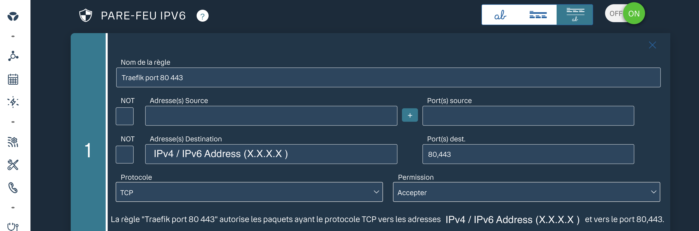

# Infra VPS — julestristan.fr

Stacks Docker Compose du VPS. Reverse-proxy + TLS automatique via Traefik,
blog basé Hugo sur la landing page.

```
.
├── Makefile              # raccourcis (make help)
├── traefik/              # reverse-proxy, Let's Encrypt, headers de sécurité
│   ├── compose.yaml
│   ├── dynamic.yml       # middlewares + options TLS (rechargé à chaud)
│   ├── .env              # ACME_EMAIL, ACME_CASERVER   (non versionné)
│   └── letsencrypt/      # acme.json                    (non versionné)
└── blog/                 # Ghost 5 (SQLite)
    ├── compose.yaml
    ├── .env              # GHOST_URL, BLOG_HOST         (non versionné)
    └── content/          # données + thèmes + images    (non versionné)
```

## To Install

- Docker + plugin Compose v2
- `make` (`sudo apt install make`) — sinon lancer les commandes `docker compose` à la main
- DNS : `julestristan.fr` (et éventuels sous-domaines) → IP du VPS
- Ports 80 et 443 ouverts sur le pare-feu

## Init

```bash
cp traefik/.env.example traefik/.env   # puis éditer
cp blog/.env.example   blog/.env       # puis éditer

make up        # Create "web" internal docker network + run docker services
make ps
```

## Dashboard Traefik

Exposé uniquement sur `127.0.0.1:8080` (jamais public). Depuis le poste local :

```bash
ssh -L 8080:localhost:8080 <vps>
# puis http://localhost:8080/dashboard/
```

## Opérations courantes

| Commande | Effet |
|---|---|
| `make up` / `make down` | start / stop a service |
| `make restart` | restart all |
| `make pull` | update docker images |
| `make logs S=blog` | follow logs |
| `make ps` | container status |

## Notes

- Voir pourquoi le routing en interne est bloqué
- Ajouter règle firewall IPv6 sur la box pour router les demandes HTTP / HTTPS (voir pour NAT loopback)
- Whitelist le port 22 de la box internet pour connexion SSH externe



## Security

- **fail2ban** (sshd avec jail: `maxretry = 3`, `bantime = 1d`)
- **UFW** Seuls les ports `22/tcp` (SSH), `80/tcp` (HTTP) et `443/tcp` (HTTPS) sont ouverts pour l'IP publique
